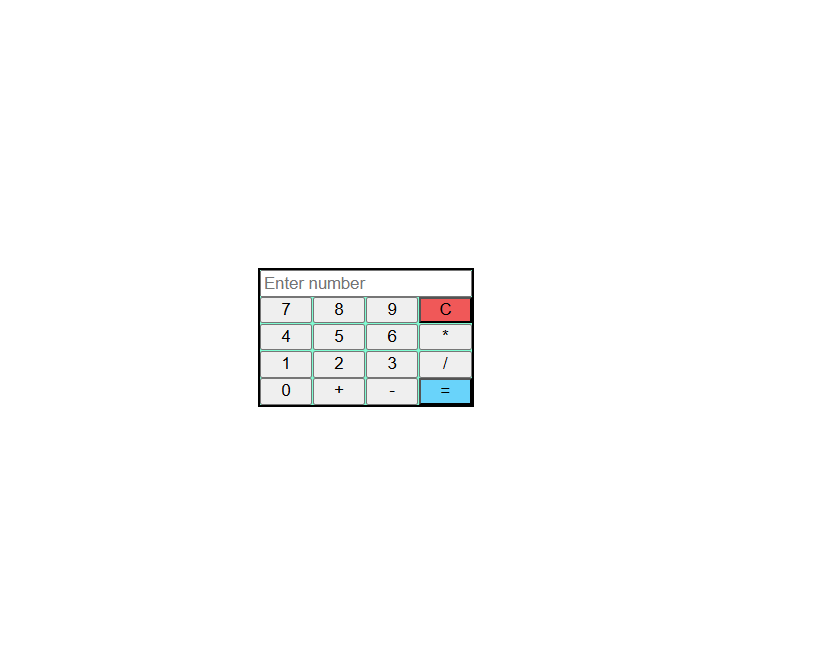

# 🧮 Calculator App

A simple and interactive calculator built using **HTML, CSS, and JavaScript**.
This project demonstrates basic arithmetic operations and clean state management in JavaScript.

---

## 🚀 Live Demo

👉 [View Live Project](https://69f7bf222d5c306141a15b39--calculator-app-rohan.netlify.app/)

---

## 📸 Preview

---

## ✨ Features

* Perform basic operations:

  * ➕ Addition
  * ➖ Subtraction
  * ✖️ Multiplication
  * ➗ Division
* Clear (`C`) functionality
* Handles edge cases like **division by zero**
* Dynamic display updates
* Clean and minimal UI

---

## 🧠 Concepts Practiced

* DOM manipulation
* Event handling
* State management in JavaScript
* Handling edge cases
* Operator logic flow

---

## 📂 Project Structure

* `index.html` → Structure of the calculator 
* `style.css` → Styling and layout 
* `index.js` → Core calculator logic 
* `todo.md` → Development checklist 

---

## ⚙️ How It Works

1. User inputs numbers using buttons
2. Operator is selected (`+`, `-`, `*`, `/`)
3. Previous operation is calculated before applying a new one
4. Result is displayed when `=` is pressed
5. State resets or updates accordingly

---

## 🛠️ Tech Stack

* HTML
* CSS
* JavaScript (Vanilla JS)

---

## 📌 Future Improvements

* Add decimal support (`.`)
* Keyboard input support
* Better UI/UX design
* Expression-based calculation (BODMAS)

---

## 🙌 Author

**Rohan**

---

## ⭐ If you like this project

Give it a ⭐ on GitHub!
